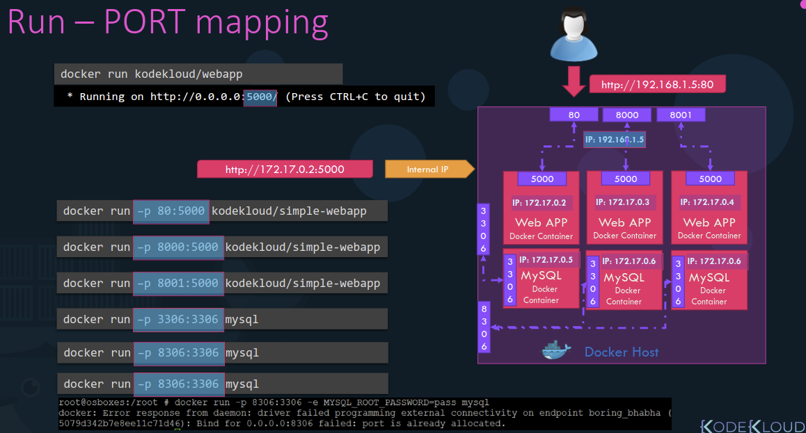
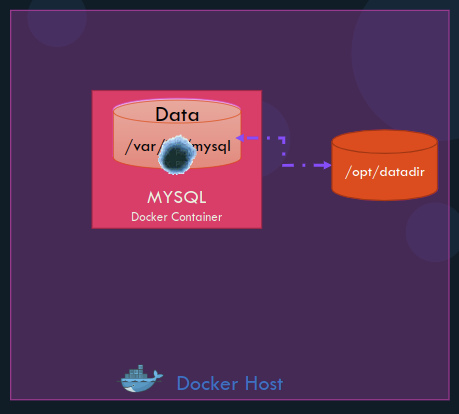
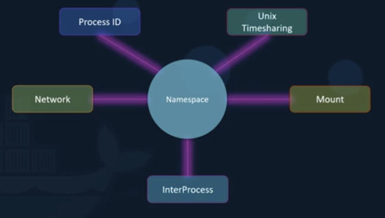
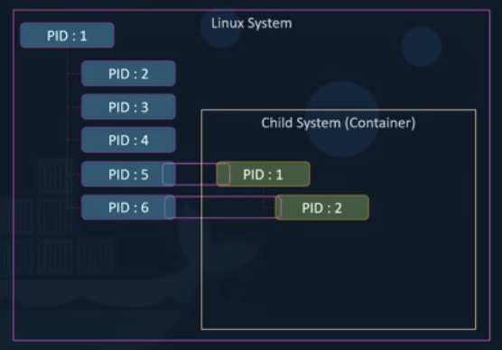

# ft_server

## Docker Commands

### Start a container

```bash
docker run <image-name>
```

### List containers

```bash
docker ps  
docker ps -a
```

### Stop a container

```bash
docker stop <image-name/id>
```

### Remove a container

```bash
docker rm <image-name/id>
```

### list images

```bash
docker images
```

### Remove images

```bash
docker rmi <image-name/id>
```

### Download an image

```bash
docker pull <image-name>
```

### Append a command

```bash
docker run <image-name> <command args>
docker run ubuntu sleep 5
```

### Execute a command

```bash
docker exec <container-name> <command args>
docker exec <container-name> cat /etc/host
```

### Attach & Detach

```bash
# run in background with -d
docker run -d <image-name>
# to attach the container
docker attach <name/>id>
```

## Docker Run

### tag

default tag: latest

```bash
docker run <name:tag>
docker run redis:4.0
```

### STDIN

```bash
docker run -i <container-name> <command args>
docker run -it <container-name> cat /etc/host
```

### PORT mapping

```bash
docker run -p <port-num-in-container> <port-num-on-Docker-host>
docker run -p 8080:80

docker run -p <host-ip>:<port-num-in-container> <port-num-on-Docker-host>
docker run -p 192.168.1.100:8080:80

docker run -p <port-num-in-container> <port-num-on-Docker-host>/<protocol>
docker run -p 8080:80/tcp -p 8080:80/udp
```



### Volume mapping

```bash
docker run -v <name-of-volume>:<path-of-file/>dir-mounted-on-container>:<options> 
docker run -v /opt/datadir:/var/lib/mysql
# options are optional, eg: ro, etc
```



### Inspect container

```bash
docker inspect <name/id>
```

### Container logs

```bash
docker logs <name>id>
```

### Environment variables

```bash
docker run -e <env> <image-name>
docker run -e APP_COLOR_BLUE simple_webapp_color

docker run -e <env>=<value> <image-name>
docker run -e APP_COLOR=green simple_webapp_color
docker run -e APP_COLOR=pink simple_webapp_color
```

## Docker Images

### create image

Example: create a image of a web server using flask  

1. OS - Ubuntu
2. Update apt repo
3. Install dependencies using apt
4. Install Python dependencies using pip
5. Copy source code to /opt folder
6. Run the web server using "flask" command

### Create a Dockerfile and set up the applications

Dockerfile format:  
INSTRUCTION argument

```bash
FROM Ubuntu
# start from a base OS or another image

RUN apt-get update
RUN apt-get install python

RUN pip install flask
RUN pip install flask-mysql
# install all dependencies

COPY . /opt/source-code
# copy source code

ENRTYPOINT FLASK_APP=/opt/source-code/app/py flask run
# specify entrypoint
```

#### Layered architecture4

Create the layered architecture using the Dockerfile

```bash
docker build Dockerfile -t mmunshad/my-custom-app
```

Layer 1. Base Ubuntu layer  
Layer 2. Changes in apt packages  
Layer 3. Changes in pip packages  
Layer 4. Source code  
Layer 5. Update Entrypoint with "flask" command

Build is cashed, in case of failure or add more layers, cashes are used to improve the rebulid speed.

#### Push the image

```bash
Docker push mmunshad/my-custom-app
```

### Command & Entrypoint

#### CMD

In docker file, to define a default command

```bash
# for example
CMD ["nginx"]
CMD ["mysql"]
CMD ["bash"]
```

To create your own command

```bash
CMD command param 1
CMD ["command","param 1"]
# for example
CMD sleep 5
CMD ["sleep","5"]
```

#### Entrypoint

To make the parameter of command not hard coded

```bash
# name the image ubuntu-sleeper, then in Dockerfile
FROM Ubuntu

ENTRYPOINT ["sleep"]

# in console run 
docker run ubuntu-sleeper 10
#command at startup became: sleep 10
```

#### Use them together

```bash
# in Dockerfile
FROM Ubuntu

ENTRYPOINT ["sleep"]

CMD ["5"]
```

Command at Startup: sleep 5; if not specify any parameter in console  
If specify a parameter in console, the specified parameter will overwrite the default

## Docker Engine

### Competences

Docker engine refers to a host with Docker installed on it. When you install Docker on a linux host you're actually installing 3 different competence:

- Docker CLI
- REST API server
- Docker Deamon


**Docker Deamon** is a background process that manages Docker objects such as the images containers volumes and networks. The **Docker REST API** server is the SPI interface that programs can use to talk to the deamon and provide instructions. You could create your own tools using this REST API. And the **Docker CLI** is nothing but the command line interface that we've been using to perform actions such as running a container, stopping containers etc. It uses the REST API to interact with the Docker deamon.

Note: the Docker CLI need not necessarily be on the same host. It could be on another system like a laptop and can still work with a remote Docker engine.


```bash
docker -H=<remote-docker-engine-address>:<port> <command>
# example: tun a container based on Nginx on a remote Docker host
docker -H=10.123.2.1:2375 run nginx
```

### Containerization

Docker uses **namespace** to isolate workspace process. **Process ID**, **Network**, **InterProcess**, **Mount** and **Unix Timesharing systems** are created in their own namespace. Thereby providing isolation between containers.



#### Namespace - PID

Whenever a Linux system boots up it starts with just one process with a process id of 1. This is the root process and kicks off all the other processes in the system. By the time the system boots up completely, we have a handful of processes running. This can be seen by running the **ps** command to list all the running processes.  
The process ids are unique and two processes cannot have the same PID. Now if we were to create a container which is basically like a child system within the current system. It is an independent system on its own and it has its own set op processes origination from a root process with a PID of 1. But there is no hard isolation between the container and the underlying host. So the processes running inside the container are in fact processes running on the underlying host and two processes cannot have the same PID of 1. This is where namespace is come into play.  
With PID namespaces each process can have multiple process ids associated with it. For example when the processes start int the container, it's actually just another set of processes on the base Linux system and it gets the next available PID. In this case 5 and 6. And they also get another PID starting with PID 1 in the container namespace which is only visible inside the container. So the container thinks that it has its own root process tree and so it is an independent system.  



### cgroups

The underlying Docker host as well as the containers share the same system resources such as CPU and memory. There is not restriction as to how much of a resource a container can use and hence a container may end up utilizing all of the resources on the underlying host. But there is a way to restrict the amount of CPU or memory a container can use.

Docker uses **cgroups** or control groups to restrict the amount of hardware resources allocated to each container.

```bash
docker run --cpu=.5 ubuntu
# the container does not take up more than 50 percent of the host CPU at any given time
docker run --memory=100m ubuntu
# limits the amount of memory the container can use to 100 megabytes
```
