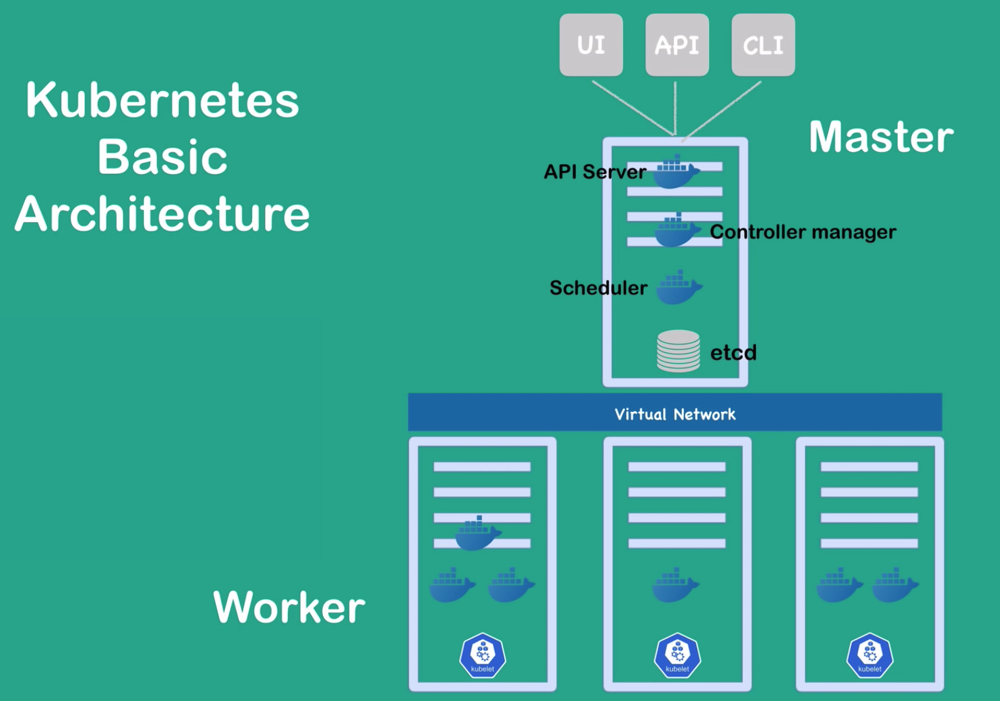

# ft_services

[k8s docs](https://kubernetes.io/docs/home/)

## Definition of Kubernetes

- Open source container orchestration tool.
- helps manage containerized applications in different deployment environments.

### features

- High Availability or no downtime
- Scalability or high performance
- Disaster recovery - backup and restore

## Basic architecture

### Worker nodes

- On worker nodes your applications are running
- kubelet: primary "node agent"
- different number of containers

### Master nodes

- On master nodes important Kubernetes processes are running (also in containers)
- API Server: entrypoint to K8s cluster (UI, API, CLI...)
- Controller manager: keeps track of what is happening in the cluster
- Scheduler: ensures Pods placement
- etcd: K8s backing store

### virtual Network

- so that master nodes and worker nodes can talk to each other
- creates one unified machine



## Basic concepts

### Pot

- **Pot** is the smallest units a user will configure and interact with
- is a wrapper of containers
- on each worker node there are multiple pods, and inside of a pod there are one or multiple containers
- usually per application you would have one pod, unless the application needs some helper, then you can have multiple containers in on pod
- the virtual network assign each pod its own IP address, so each pd is its own self-contained server
- Pods are recreated frequently. Pots gets new IP address on creation. So **Service** are used as an alternative or a substitute to those  IP  addresses.

### Cluster

- Collective term for the entirety of our running kubernetes setup (all machines/nodes).

### Nodes

- How kubernetes refers to physical/virtual machines that our cluster is running on.

### Deployment

- a group of one or more pods, based on its settings it will create one or more pods and manage their state (recreation in case of fail etc).

### Secret

- Secrets let you store sensitive information, such as user credentials and passwords.
It can be referenced to create an environment variable from the secret.

### Service

- A reliable way to expose an application as a network service using an external IP adress or a clusterIP (virtual IP used to communicate between pods).
- It is possible to communicate between pods without a service, but you would be required to have the clusterIP of the pod in question. By making a service and setting up the matchLabel selector we can now connect to the clusterIP of the service by using the service name as that will resolve to the clusterIP. (and that will in turn connect us through to the pod thats connected to the service)
  
Subtypes:  
| Type                                                                                                            | Description                                                                                |
|-----------------------------------------------------------------------------------------------------------------|--------------------------------------------------------------------------------------------|
| [ClusterIP](https://kubernetes.io/docs/concepts/services-networking/service/#publishing-services-service-types) | Default service, only used to communicate from pod to pod.                                 |
| [NodePort](https://kubernetes.io/docs/concepts/services-networking/service/#nodeport)                           | Bind the service to a port on the node's external IP (something we're not allowed to use). |
| [LoadBalancer](https://kubernetes.io/docs/concepts/services-networking/service/#loadbalancer)                   | Connect to the internal loadbalancer to request an external IP address for the service.    |

### Configmap

- Dedicated object used to store configuration settings, both for internal processes (metalLB), and also configurations of our docker hosted applications (nginx, phpmyadmin, wordpress etc).

### Role

- Permissions, that's all they are. Permissions relating to the kubernetes API.

### Rolebind

Connecting the subject (an account, serviceaccount etc..) to the permissions (the role).

### Serviceaccount

User that's associated with pods, by default there exists one service account named 'default' that is automatically associated with every pod that gets created, if nothing else is specified.

### PersistentVolume

Storage that will persist between pod crashes, as its lifetime is independent of the pod.

### PersistentVolumeClaim

Used to bind a PersistentVolume with a pod.

## Configuration File

K8s clients can be a UI (Kubernetes dashboard...), an API (script or curl command) or a command line tool (cube CTL).  
The all talk to the API server and they send their configuration requests to the API server.  
These requests have to be either in YML or JSON format.

### example

``` yml
apiVersion: apps/v1
kind: Deployment
metadata:
  name: my-app
    labels:
      app: my-app
spec:
  replicas: 2
    selector:
      matchLabels:
        app: my-app
  template:
    metadata:
      labels:
        app: my-app
    spec:
      containers:
        - name: my-app
          image: my-image
          env:
            - name: SOME_EMV
              value: $SOME_ENV
          ports:
            - containerPort: 8080
```

- Deployment: a template for creating pods
- the requests in k8s if declarative: is == should
- Controller Manager checks if desired state == actual state

[basic dubectl commands](https://gitlab.com/nanuchi/youtube-tutorial-series/-/blob/master/basic-kubectl-commands/cli-commands.md)
