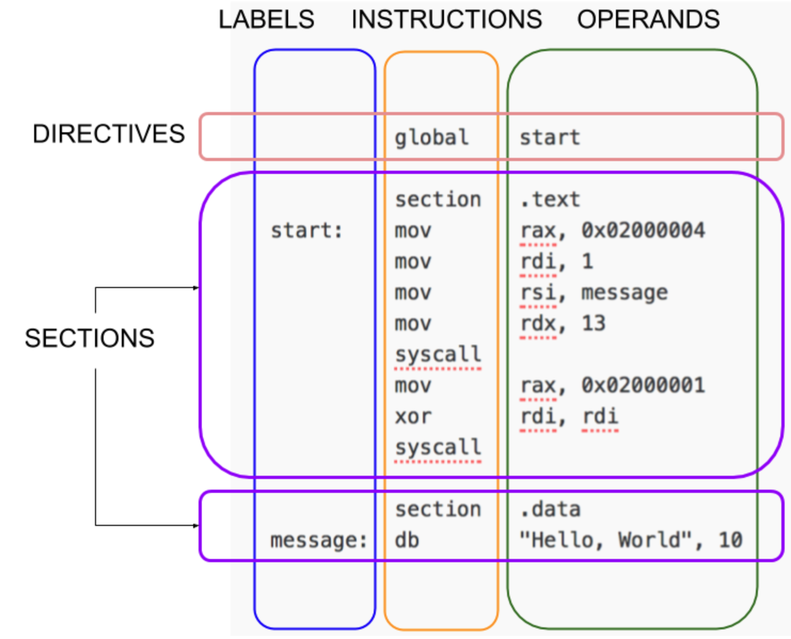

# x64 NASM notes

## Registers

"Scratch" registers any function is allowed to overwrite, and use for anything you want without asking anybody.
"Preserved" registers have to be put back ("save" the register) if you use them.

| 64 bit | 32 bit | 16 bit | 8 bit | type              | note                                                                              |
|--------|--------|--------|-------|-------------------|-----------------------------------------------------------------------------------|
| rax    | eax    | ax     | al    | scratch           | accumulator                                                                       |
| rbx    | ebx    | bx     | bl    | preserved         | base, addressing                                                                  |
| rcx    | ecx    | cx     | cl    | scratch           | counter, iterations                                                               |
| rdx    | edx    | dx     | dl    | scratch           | data                                                                              |
| rsp    | esp    | sp     | spl   | preserved         | stack pointer (points to the top of the stack)                                    |
| rbp    | ebp    | bp     | bpl   | preserved         | frame pointer (sometimes store the old value of the stack pointer, or the "base") |
| rsi    | esi    | si     | sil   | scratch/preserved | scratch and used to pass function argument #2 in Linux, preserved in Windows      |
| rdi    | edi    | di     | dil   | scratch/preserved | scratch and used to pass function argument #1 in Linux, preserved in Windows      |
| r8     | r8d    | r8w    | r8b   | scratch           |                                                                                   |
| r9     | r9d    | r9w    | r9b   | scratch           |                                                                                   |
| r10    | r10d   | r10w   | r10b  | scratch           |                                                                                   |
| r11    | r11d   | r11w   | r11b  | scratch           |                                                                                   |
| r12    | r12d   | r12w   | r12b  | preserved         |                                                                                   |
| r13    | r13d   | r13w   | r13b  | preserved         |                                                                                   |
| r14    | r14d   | r14w   | r14b  | preserved         |                                                                                   |
| r15    | r15d   | r15w   | r15b  | preserved         |                                                                                   |

+ A 64 bit linux machine passes function parameters in rdi, rsi, rdx, rcx, r8, and r9.  Any additional parameters get pushed on the stack.  OS X in 64 bit uses the same parameter scheme.

+ Win64 function parameters go in registers rcx, rdx, r8, and r9 and treats the registers rdi and rsi as preserved. Win64 functions assume you've allocated 32 bytes of stack space to store the four parameter registers, plus another 8 bytes to align the stack to a 16-byte boundary.

## Memory access

| C/C++ datatype | Bits | Bytes | Access memory | Allocate memory |
|----------------|------|-------|---------------|-----------------|
| char           | 8    | 1     | BYTE [ptr]    | db              |
| short          | 16   | 2     | WORD [ptr]    | dw              |
| int            | 32   | 4     | DWORD [ptr]   | dd              |
| long           | 64   | 8     | QWORD [ptr]   | dq              |

You can convert values between different register sizes using different mov instructions:

<table class="tg">
<thead>
  <tr>
    <th class="tg-0lax"></th>
    <th class="tg-baqh" colspan="4">Source Size</th>
    <th class="tg-0lax"></th>
  </tr>
</thead>
<tbody>
  <tr>
    <td class="tg-0lax"></td>
    <td class="tg-0lax">64 bit rcx</td>
    <td class="tg-0lax">32 bit ecx</td>
    <td class="tg-0lax">16 bit cx</td>
    <td class="tg-0lax">9 bit cl</td>
    <td class="tg-0lax">Notes</td>
  </tr>
  <tr>
    <td class="tg-0lax">64 bit rax</td>
    <td class="tg-0lax">mov rax,rcx</td>
    <td class="tg-0lax">movsxd rax,ecx</td>
    <td class="tg-0lax">movsx rax,cx</td>
    <td class="tg-0lax">movsx rax,cl</td>
    <td class="tg-0lax">Writes to whole register</td>
  </tr>
  <tr>
    <td class="tg-0lax">32 bit eax</td>
    <td class="tg-0lax">mov eax,ecx</td>
    <td class="tg-0lax">mov eax,ecx</td>
    <td class="tg-0lax">movsx eas,cx</td>
    <td class="tg-0lax">movsx eax,cl</td>
    <td class="tg-0lax">Top half of destination gets zeroed</td>
  </tr>
  <tr>
    <td class="tg-0lax">16 bit ax</td>
    <td class="tg-0lax">mov ax,cx</td>
    <td class="tg-0lax">mov ax,cx</td>
    <td class="tg-0lax">mov ax,cx</td>
    <td class="tg-0lax">movsx ax,cl</td>
    <td class="tg-0lax">Only affects low 16 bits, rest unchanged.</td>
  </tr>
  <tr>
    <td class="tg-0lax">8 bit al</td>
    <td class="tg-0lax">mov al,cl</td>
    <td class="tg-0lax">mov al,cl</td>
    <td class="tg-0lax">mov al,cl</td>
    <td class="tg-0lax">mov al,cl</td>
    <td class="tg-0lax">Only affects low 8 bits, rest unchanged.</td>
  </tr>
</tbody>
</table>

## Instructions

[x86 and amd64 instruction reference](https://www.felixcloutier.com/x86/)

| Mnemonic     | Purpose                                                                                                                                                                                                                                 | Examples                                                                                                             |
|--------------|-----------------------------------------------------------------------------------------------------------------------------------------------------------------------------------------------------------------------------------------|----------------------------------------------------------------------------------------------------------------------|
| mov dest,src | Move data between registers, load immediate data into registers, move data between registers and memory.                                                                                                                                | mov rax,4  ; Load constant into rax mov rdx,rax  ; Copy rax into rdx mov rdx,[123]  ; Copy rdx to memory address 123 |
| push src     | Insert a value onto the stack. Useful for passing arguments, saving registers, etc.                                                                                                                                                     | push rbp                                                                                                             |
| pop dest     | Remove topmost value from the stack. Equivalent to "mov dest, [rsp]; add 8,rsp"                                                                                                                                                         | pop rbp                                                                                                              |
| call func    | Push the address of the next instruction and start executing func.                                                                                                                                                                      | call print_int                                                                                                       |
| ret          | Pop the return program counter, and jump there.  Ends a subroutine.                                                                                                                                                                     | ret                                                                                                                  |
| add dest,src | dest=dest+src                                                                                                                                                                                                                           | add rax,rdx ; Add rbx to rax                                                                                         |
| mul src      | Multiply rax and src as unsigned integers, and put the result in rax.  High 64 bits of product (usually zero) go into rdx.                                                                                                              | mul rdx ; Multiply rax by rdx ; rax=low bits, rdx overflow                                                           |
| div src      | Divide rax by src, and put the ratio into rax, and the remainder into rdx. Bizarrely, on input rdx must be zero, or you get a SIGFPE.                                                                                                   | mov rdx,0 ; avoid error div rcx ; compute rax/rcx                                                                    |
| shr val,bits | Bitshift a value right by a constant, or the low 8 bits of rcx ("cl"). Shift count MUST go in rcx, no other register will do!                                                                                                           | add rcx,4 shr rax,cl ; shift by rcx                                                                                  |
| jmp label    | Goto the instruction label:.  Skips anything else in the way.                                                                                                                                                                           | jmp post_mem mov [0],rax ; Write to NULL! post_mem:                                                                  |
| cmp a,b      | Compare two values.  Sets flags that are used by the conditional jumps (below)                                                                                                                                                          | cmp rax,10                                                                                                           |
|  jl label    | Goto label if previous comparison came out as less-than.  Other conditionals available are: jle (<=), je (==), jge (>=), jg (>), jne (!=), and many others. Also available in unsigned comparisons: jb (<), jbe (<=), ja (>), jae (>=). | jl loop_start  ; Jump if rax<10                                                                                      |

## Structure of a NASM Program

[NASM Tutorial](https://cs.lmu.edu/~ray/notes/nasmtutorial/)

NASM is line-based. Most programs consist of directives followed by one or more sections. Lines can have an optional label. Most lines have an instruction followed by zero or more operands.

Generally, you put code in a section called .text and your constant data in a section called .data.

## SystemCalls in Assembly

[System Calls](https://en.wikibooks.org/wiki/X86_Assembly/Interfacing_with_Linux)