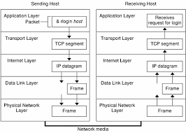

# Netwhat notes
*This is the notes I made for the **Netwhat** project. If you find any mistakes please be free to correct me.

## TCP/IP Networking

The most common network stack today is the *Transmission Control Protocol Internet Protocol (TCP/IP)* stack, and it's components are:  

- network hardware
- data packets
- protocols for data exchange

### Network Hardware

**Types**  
The most common is Ethernet. Most servers use *twisted-pair cabling*, if is identified by a *T* suffix to the Ethernet variety name, as in 10BaseT or 100BaseT (the numbers denote the speed of the protocol in megabits per second --- Mbps).  
Other types of network hardware include: Token Ring, LocakTalk, Fiber Distributed Data Interface (FDDI), High-Performance Parallel Interface (HIPPI), and Fiber Channel.  
Wireless networking (aka Wi-Fi) os am exception to Ethernet's dominance. Common wireless protocol include 802.11a (54Mbps), 802.11b (11Mbps), 802.11g (54Mbps) and 802.11n (300Mbps). With the exception of the rarely used 802.11a, Wi-Fi protocols are compatible with on another, albeit at the speed of the slowest protocol in use.  
Many network types require the use of a central device known as a **hub** or **switch**.  You plug every computer on a local network into this central device, and it then passes data between the computers. As a general rule, switches are superior to hubs. Hubs mirror all traffic to all computers, whereas switches are smart enough to send packets only to the intended destination. Switches also allow *full-duplex transmission*, in which both parties can send data ant the same time. Hubs permit only *half-duplex transmission*, in which the two computers must take turns.  
Computers with Wi-Fi adapters can be configured to communicate directly with one another, but it's more common to employ a wireless access point, which licks together both wireless and Ethernet devices.  

**Network Packets**  
Modern networks operate on discrete chunks of data known as *packets*. There are several types of packets and they can be stored within each other. For instance, Ethernet includes its own packet type -- known as a *frame*.  
A data transfer can involve several layers of wrapping and unwrapping data. With each layer, packets from the adjacent layer may be merged or split up.

**Network Protocol Stacks**  
A *protocol stack* is a set of software that converts and encapsulates data between layers of abstraction.There are several layers to any protocol stack, and they interact in highly specified ways. It's often possible to swap out one component for another at any given layer.  

## Network Addressing

**Types:**  

- network hardware addresses
- numeric IP addresses
- test-based hostnames

### Addressing Hardware

Dedicated network hardware have unique hardware addresses, also known as *Media Access Control (MAC) addresses* programmed into them. In the case of Ethernet, these addresses are 6 bytes in length, and they're generally expressed as hexadecimal (base 16) numbers separated by colons.  
To find the hardware address, type **ifconfig eth***n*, where *n* is the number of the interface (0 for the first card, 1 for the second, and so on). *Note:* wireless devices have names of the form **wlan***n*.

### IP address

**IP**  
The *Internet Protocol(IP)* is an Internet-layer (aka a network-layer ot layer 2) protocol.

**IPv4**  
IPv4 uses 32-bit addresses, and they are usually expressed as 4 base-10 numbers (0-255) separated by periods.  
This address is broken into two components:  
- a network address: identifies a block of Ip addresses that are used by one physical network
- a computer address: identifies one computer within that network  
The 4-byte IPv4 address and 6-byte Ethernet address are mathematically unrelated. 

**IPv6**  
IPv6 uses 128-bit addresses. They consist of 8 groups of 4-digit hexadecimal numbers separated by colons. (If one ot more groups of four digits is 0000, that group or those groups may be omitted, leaving two colons).  
IPv6 uses 2 types of network addresses:  
- link-local: to communicate on the local networks, it's nonroutable, and can only be used for local network connectivity. 
- global: utilizes a network address advertised by a router on the local network.  
Note:  System creates a link-local IPv6 network address using the network address along with a combination of the MAC address of the network interface.

## Netmask

A **netmask** (also known as the *network mask* or *subnet mask*) is a 32-bit "mask" used to divide an IP address into subnets and specify the networks available hosts.  

## subnet of an IP with Netmask

When using binary: the netmask uses binary 1 values to represent the network portion of an address and binary 0 values to represent the computer address.  
The network portion ordinarily leads the computer portion.

## different way to represent an IP address with the Netmask

### Dotted quad notation

Use all 4 bytes of the netmask.  
For example, IP address of 172.30.9.102 with netmask of 255.255.0.0, then network address is 172.30.0.0

### CIDR (Classless Inter-Domain Routing) form

use a sigle number representing the nember of network bits in the address. This number usuallu follows the IP address and a slash. For example, 172.30.9.102/16 is equivalent to 172.30.9.102 with a netmask of 255.255.0.0.

## broadcast address of a subnet

A *broadcast* is a type of network transmission that's sent to all the computers on a local network, or occasionally all of the computers on a remote network.  
Under TCP/IP,  a broadcast is done by specifying binary 1 values in all of the machine bits of the IP address.  
The ultimate broadcast address is 255.255.255.255, which sends data to all computers on a network segment.  
Convert between the broadcast address and netmask:  
- Netmask consist of whole-byte valuse: replace the IP address components that have 0 values in the dotted quad netmask with 255 values.  
e.g. IP address of 172.30.9.102 & netmask of 255.255.0.0 ==> broadcast address of 172.30.255.255  
- CIDR address: resort to binary numbers, set the network address values to 1 when the netmask value to 0, then convert back into base 10 notation  
e.g. IP address of 172.30.9.102 & netmask of 255.255.128.0 (equal to 172.30.0.0/17)  
     172.30.9.102   --->  10101100 00011110 00001001 01100110  
	 255.255.128.0  --->  11111111 11111111 10000000 00000000  
    ==> 10101100 00011110 01111111 11111111  --->  172.30.127.255

## class of IP address

IPv4 networks have been broken into one of several classes:  
- Classes A, B and C are for general networking use
- Class D addresses are reserved for *multicasting*: sending data to multiple computers simultaneously
- Class E addresses are reserved for future use  

There are also a few special cases:  
- 127.x.y.z addresses are reserved for use as *loopback* (aka *localhost*) devices
- addresses in which all of the machine bits are set to 1 refer to the network block itself -- they're used for broadcasts
- addresses in which all of the machine bits are set to 0 refer to the network address

## difference between public and private IPs

Within each of the three general-use network classes is a range of addresses reserved for private use.

IPv6 has its equivalent to private addresses. Besides link-local address, IPv6 also uses *site-local addresses*, which may be routed whithin a site but not off site. They begin with the hexadecimal number fec, fed, fee, or fef.

**TABLE** IPv4 network classes and private net work ranges

| Class | Address range                 | Reserved private addresses       |
|-------|:-----------------------------:|:--------------------------------:|
| A     | 1.0.0.0    -  127.255.255.255 | 10.0.0.0      -  10.255.255.255  |
| B     | 128.0.0.0  -  191.255.255.255 | 172.16.0.0    -  172.31.255.255  |
| C     | 192.0.0.0  -  233.255.255.255 | 192.168.0.0   -  192.168.255.255 |
| D     | 224.0.0.0  -  239.255.255.255 | none                             |
| E     | 240.0.0.0  -  255.255.255.255 | none                             |

## TCP && UDP

### ICMP

The *Internet Control Message Protocol (ICMP)* is a simple protocol for communicating data. ICMP is most often used to send error messages between computers. This is often done by modifying an IP packet and returning it to its sender, which means that ICMP is technically an Internet-layer protocol, although it relies upon IP.

### UCP

The *User DAtagram Protocol (UDP)* is the simplest of the common transport-layer (aka layer 3) TCP/IP protocols. It doesn't provide sophisticated procedures to correct for out-of-order packets, guarantee delivery, or otherwise improve the limitations of IP. It also means that UDP can be faster than more sophisticated tools that provide such improvements to IP. Common application-layer protocols that are built atop UDP include the Domain Name System (DSN), the Network File System (NFS), and many streaming-media protocols.

### TCP
The *Transmission Control Protocol (TCP)* creates full connections with error checking and correction as well as other features. These features simplify the creations of network protocols that must exchange large amounts of data. However TCP imposes a samall performance penalty. Most application-layer protocols are built atop TCP, for example: Simple Mail Transfer Protocol (SMAP), the Hypertext Transfer PRotocol (HTTP), and the File Transfer Protocol (FTP).

## network layers

## OSI model

## DHCP server and the DHCP protocol

The *Dynamic Host Configuration Protocol (DHCP)* is a means of automating the configuration of specific computers. It has an option that uses the hardware address to assign the same IP address consistently to a given computer.  
It enables one computer on a network to manage the settings for many other computers.

## DNS server and the DNS protocol

The *Domain Names System (DNS)* is a distributed database of computers that converts between IP address and hostnames.  
Every domain must maintain at least 2 DNS servers that can either provide the names for every computer within the domain or redirect a DNS query to another DNS server that can better handle the request.

## rules to make 2 devices communicate using IP addresses

## how routing is working with IP

## default gateway for routing

## what is a port from an IP point of view and what is it used for when connecting to an other device

A network port numbers enables you to direct traffic to a specific program.  
When they start up, servers tie themselves to specific ports, which by convention are associated with specific server programs.  
A client can direct its request to a specific port and expect to contact an appropriate server. The client's own prot number isn't fixed, it's assigned by the OS.  
**privileged ports** have numbers less than 1024. Unix and Linux systems restrict access to privileged ports to *root*.  **The unprivileged ports** -- port numbers greater than 1024 may to accessed by ordinary users.  

*NOTE: a client is a program that initiates a network connection to exchange data. A server listens for such connections and responds to them.*

**TABLE** pot numbers, TCP/UDP and their purposes

| port | TCP or UDP | Purpose                                    |
|------|------------|--------------------------------------------|
| 20   | TCP        | FTP (File Transfer Protocol) data          |
| 21   | TCP        | FTP                                        |
| 22   | TCP        | SSH (Secure Shell)                         |
| 25   | TCP        | SMTP (Simple Mail Transfer Protocol)       |
| 53   | TCP & UDP  | DNS (Domain Name System)                   |
| 67   | UDP        | DHCP (Dynamic Host Configuration Protocol) |
| 80   | TCP        | HTTP (Hypertext Transfer Protocol)         |
| 110  | TCP        | POP3 (Post Office Protocol version 3)      |
| 123  | UDP        | NTP (Network Time Protocol)                |
| 142  | TCP        | IMAP (Interactive Mail Access Protocol)    |
| 443  | TCP        | HTTPS (HTTP over SSL)                      |
